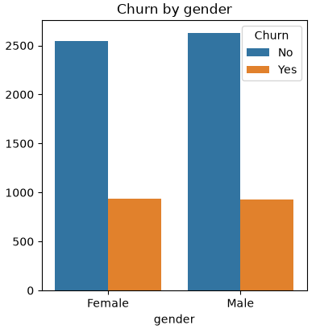
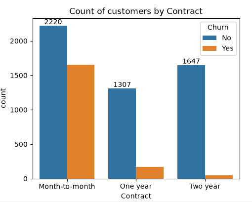
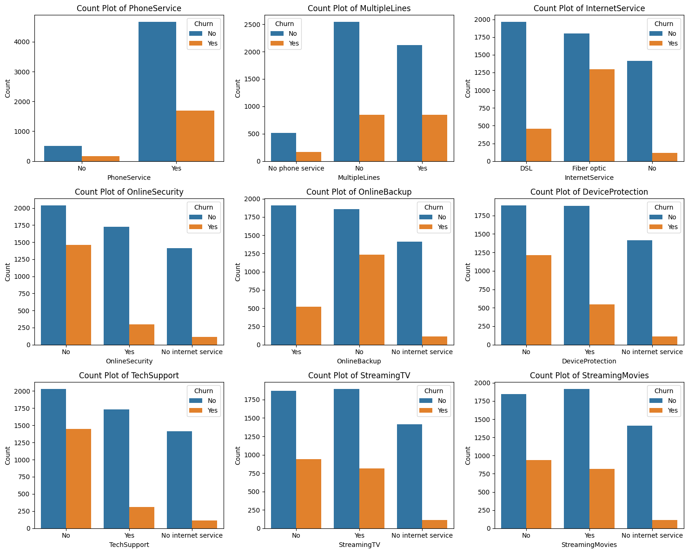
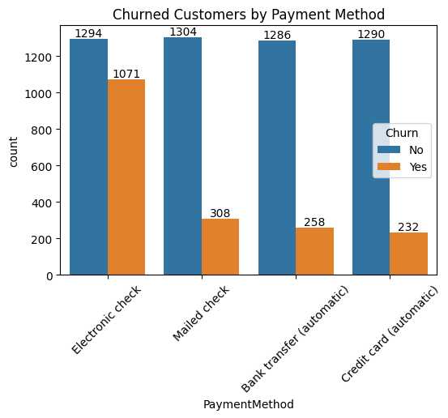

# 📉 Customer Churn Analysis using Python

## 📌 Overview

Customer churn is a key business challenge, as retaining existing customers is often more cost-effective than acquiring new ones. This project analyzes customer churn data using Python to identify patterns, explore customer behavior, and uncover factors that influence churn through data cleaning and exploratory data analysis (EDA).

---

## 🎯 Project Objectives

- Clean and preprocess customer data
- Perform exploratory data analysis (EDA)
- Visualize customer demographics and service usage
- Identify factors associated with customer churn
- Generate insights to support customer retention strategies

---

## 🛠️ Tech Stack

- Python
- Pandas
- NumPy
- Matplotlib
- Seaborn
- Jupyter Notebook / VS Code

---

## 📂 Dataset

The dataset includes customer information such as:

- Customer ID
- Gender
- Senior Citizen
- Partner & Dependents
- Tenure
- Phone Service
- Internet Service
- Contract Type
- Payment Method
- Monthly Charges
- Total Charges
- Churn Status

---

## 📊 Analysis Performed

- Data Cleaning
- Handling Missing Values
- Data Type Conversion
- Duplicate Check
- Descriptive Statistics
- Customer Churn Distribution
- Service-wise Churn Analysis
- Contract-wise Churn Analysis
- Payment Method Analysis
- Internet Service Analysis
- Monthly Charges Analysis
- Tenure Analysis

---

## 📁 Repository Structure

```
PYTHON_churn_analysis/
│
├── Dataset/
│   └── Customer Churn.csv
│
├── Notebook/
│   └── TC_churnanalysis.py
│
├── Images/
│   └── Visualizations
│
├── Report/
│   └──Telco_customer_analysis.pdf
│
└── README.md
```

---

## 📈 Visualizations

This project includes visualizations for:

- Customer Churn Distribution
   
- Gender-wise Churn
   
- Senior Citizen Analysis
   
- Contract Type Analysis
   
- Tenure Distribution
   
- Subplot
   
- Payment Method Analysis
   
  

---


## 🚀 Skills Demonstrated

- Data Cleaning
- Exploratory Data Analysis (EDA)
- Data Visualization
- Business Insight Generation
- Statistical Analysis
- Python Programming

---

---

⭐ If you found this project useful, feel free to star the repository!
